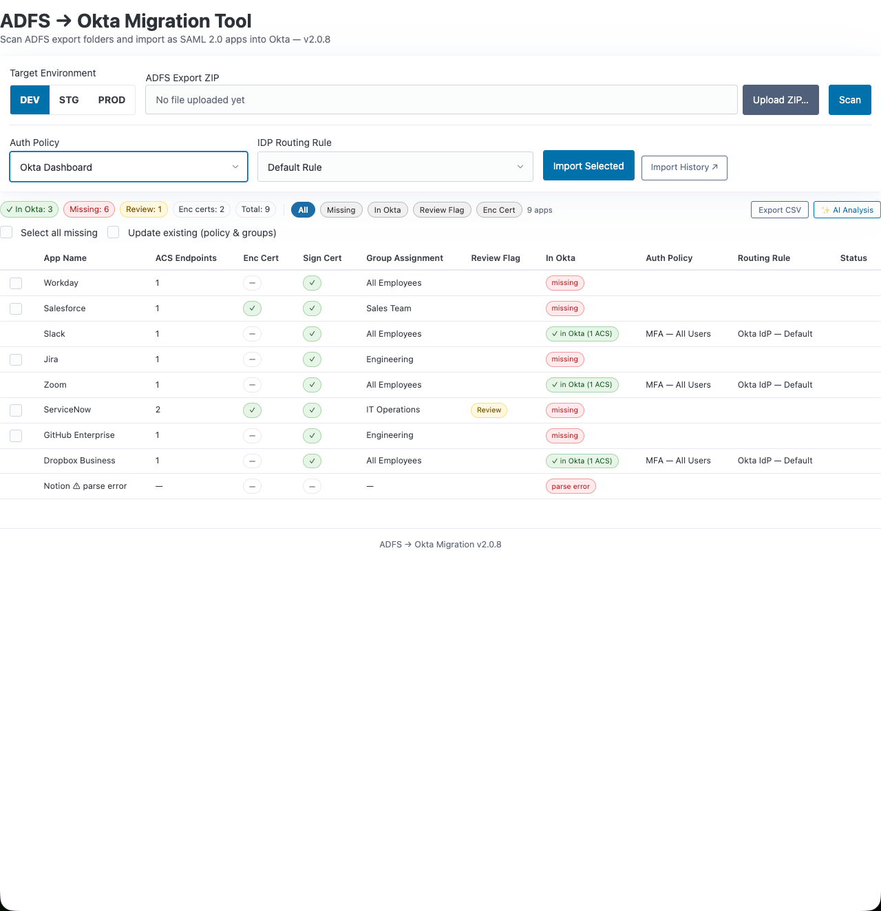

> **Export the Relying Party Trusts from an ADFS farm, upload the bundle,
> scan it against the target Okta org, and create the matching SAML 2.0
> apps through the API — with a log of every run. Built to move hundreds of
> apps without hand-typing a single one in the Admin Console.**

# ADFS to Okta Migration



---

### About this repo

Source for an internal migration tool, published for community reference.
The tool runs in private infrastructure; screenshots use synthetic app names.
Internal hostnames, tenant and resource names are replaced with placeholders
(`host.example.gov`, `your-resource-group`). The code is the code that runs;
the configuration values are not.

---

## The workflow

1. **Export** — run `scripts/Export-ADFSRelyingPartyTrusts.ps1` (v6.1, a
   WinForms picker with filter and Check All) on the ADFS farm. For each
   selected trust it writes a folder containing `<app>_config.txt` (identifier,
   ACS endpoints, NameID format, claim-rule-derived attribute lines, assignment
   hints) and the trust's signing certificate as PEM. Zip the output.
2. **Upload** — `POST /api/upload` takes the ZIP, extracts it into a per-upload
   working directory and returns a session id.
3. **Scan** — `GET /api/scan` reads every `_config.txt`, pulls the app list
   from the chosen Okta org and reports, per app: already in Okta or not,
   ACS-endpoint count, and anything that needs a human look before import.
4. **Import** — `POST /api/import` creates the missing apps as Okta SAML 2.0
   integrations (ACS URLs, audience, NameID, attribute statements, signing
   certificate upload, group/Everyone assignment) and records the result.
5. **Operate** — `/api/toggle-status` activates / deactivates an app;
   `/api/policies` and `/api/routing-rules` list what the org has; `/logs`
   shows past runs from Log Analytics.

The same import logic is available as a CLI —
`python okta_saml_import.py --env dev --input-dir <export> [--app NAME]
[--dry-run] [--skip-certs] [--max-acs N] [--debug]` — and **`--dry-run` is
CLI-only**: the web UI imports when you click Import.

## Optional: AI scan analysis

`/api/analyze-scan` sends the scan summary to a **local** Ollama model
(`llm_client.py`, see
[identity-llm-client](https://github.com/wesglockzin/identity-llm-client))
and renders its observations in the AI panel. Nothing leaves the host. The
button renders whenever the client module imports; it fails at request time
if Ollama is not running on `localhost:11434`.

## Project layout

| File | Role |
|---|---|
| `app.py` | Flask app — Okta OIDC gate, upload / scan / import / status APIs, Log Analytics run log |
| `okta_saml_import.py` | Parser for the export format + Okta REST client + CLI |
| `scripts/Export-ADFSRelyingPartyTrusts.ps1` | The export script (runs on ADFS) |
| `backfill-logs.py` | One-shot: push historical run logs into Log Analytics |
| `setup_tokens.py` | Store per-environment Okta API tokens in the OS keyring |
| `llm_client.py` | Local Ollama client for the AI panel |
| `templates/` | `index.html`, `logs.html` |
| `Dockerfile`, `setup-azure.sh` | Container image and one-time Azure Container Apps setup |

## Configuration

**Okta API tokens** — one per environment, stored in the OS keyring by
`python setup_tokens.py` (`OKTA_DEV_API_TOKEN`, `OKTA_STG_API_TOKEN`,
`OKTA_PROD_API_TOKEN`); in Azure Container Apps the same names are secrets
injected as environment variables. Org URLs live in the
`OKTA_ADMIN_ENVIRONMENTS` dict in `okta_saml_import.py`.

**Sign-in gate** — `OIDC_ISSUER`, `OIDC_CLIENT_ID`, `OIDC_CLIENT_SECRET`,
`APP_BASE_URL`, `FLASK_SECRET_KEY`. Okta OIDC, authorization code + PKCE;
access is decided by assignment on the Okta app. **If the `OIDC_*` variables
are unset the gate is disabled** — see *Known limitations*.

**Run log** — `LA_WORKSPACE_ID` / `LA_WORKSPACE_KEY` (write) and a managed
identity with Log Analytics Reader (read) for `/logs`.

## Running it

```bash
pip install -r requirements.txt
python setup_tokens.py          # once per machine
python app.py                   # http://localhost:5001
```

Deployment is Azure Container Apps, gunicorn with 2 workers × 4 threads.
`setup-azure.sh` creates the container app once; after that, images are built
and promoted by the fleet's shared scripts (build → DEV, then a digest-gated
DEV → PROD promotion).

## Known limitations

Real, known, in the order I intend to fix them.

- **Upload sessions are in-process memory.** With 2 gunicorn workers a scan
  can land on a worker that never saw the upload and report "session not
  found." Resolve uploads from the shared working directory instead (or run
  one worker).
- **Apps whose ADFS assignment can't be parsed default to Everyone** on
  import (Custom Policy trusts, lookup errors). The scan flags them for
  review; the import does not yet refuse them.
- **Gate fails open when unconfigured.** A fail-closed startup check belongs
  in production deployments.
- **`run_id` is interpolated into the Log Analytics query** without
  validation; it should be checked as 32-hex before use.
- **Duplicate-label lookup is a prefix search** (`?q=`, 10 results), so an
  org with many similar labels can miss an exact match and create a duplicate.
- The AI panel's HTML is built with `innerHTML`; app names from the export
  should be escaped.
- No automated tests; no CI yet.

## Version

`APP_VERSION` in `app.py` is authoritative (currently 2.0.x); the export
script carries its own version in its header.

## License

MIT — see [LICENSE](LICENSE).

## Author

Wes Glockzin
